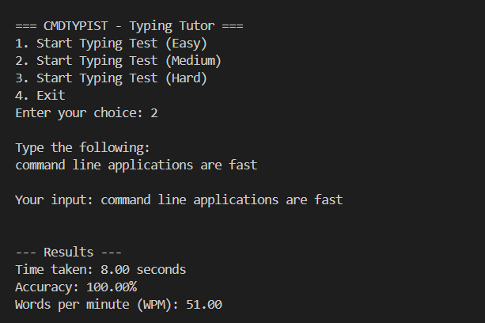

# CMDTYPIST – A Command-Line Typing Tutor 🧠⌨️

**CMDTYPIST** is a lightweight, terminal-based typing tutor written in C. It helps users improve their typing speed and accuracy through short, level-based typing tests.

---

## 🚀 Features

- ✅ Easy, Medium, and Hard difficulty levels
- ⏱️ Measures typing speed (WPM), accuracy, and time taken
- 🧮 Real-time scoring and feedback
- 🔁 Unlimited practice with randomized sentences
- 🧼 Simple and clean command-line interface

---

## 📸 Demo

=== CMDTYPIST - Typing Tutor ===

Start Typing Test (Easy)

Start Typing Test (Medium)

Start Typing Test (Hard)

Exit
Enter your choice: 1

Type the following:
the cat sat on the mat

Your input: the cat sat on the mat

--- Results ---
Time taken: 4.00 seconds
Accuracy: 100.00%
Words per minute (WPM): 72.00

